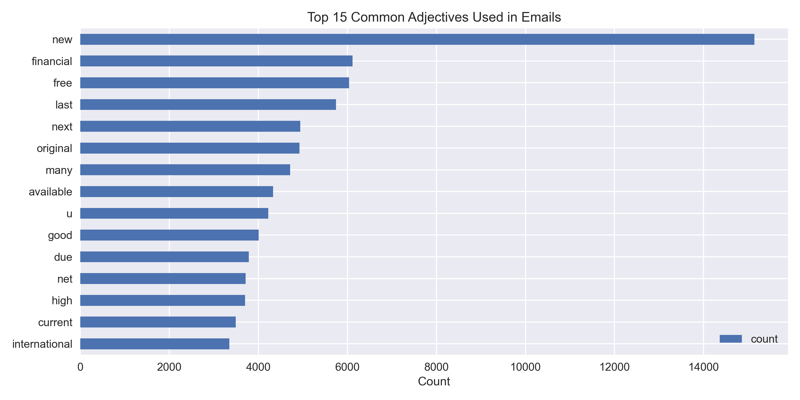
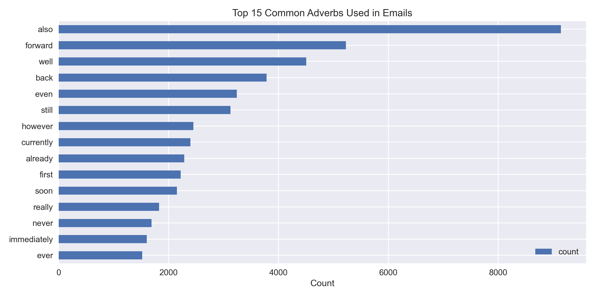
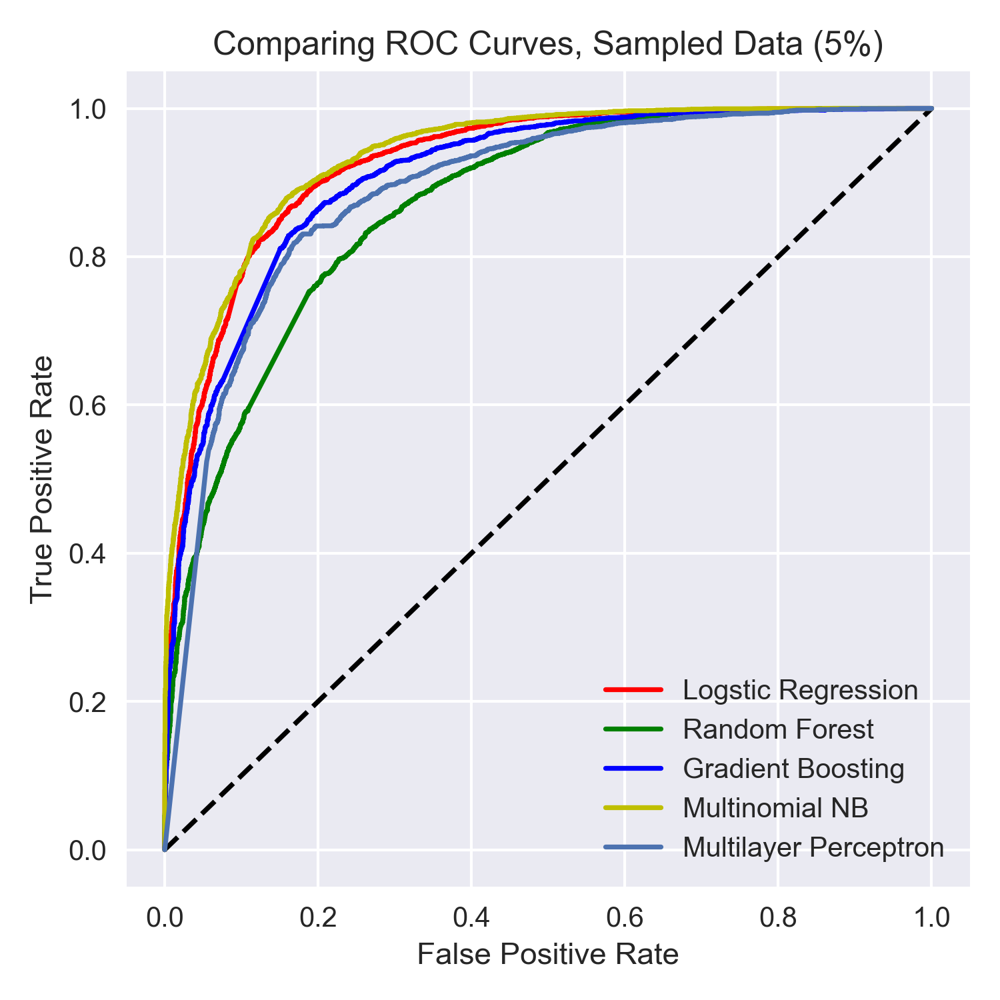

# Filtering Enron Spam Emails using Supervised Learning

*Edited on: 12/05/2020 by Tong Jin*

## Project Name

Filtering Spam Emails with Supervised Learning Algorithms Using the Enron Datasets

## Team Members

- [Jiejie Wang](https://github.com/jw6190), NYU [A3SR](https://steinhardt.nyu.edu/programs/applied-statistics-social-science-research)
- [Tong Jin](https://github.com/tong-jin-nyu), NYU [A3SR](https://steinhardt.nyu.edu/programs/applied-statistics-social-science-research)
- [Zixuan Zhou](https://github.com/timzhou1009), NYU [A3SR](https://steinhardt.nyu.edu/programs/applied-statistics-social-science-research)

## Description

This project applies supervised machine learning techniques to build a spam email classifier which automatically detects spam emails (junk messages). It is the final project of the [DS-GA 1001: Introduction to Machine Learning](https://github.com/briandalessandro/DataScienceCourse) course at New York University.

### Background

Have you ever checked your mailbox to get a letter that you were expecting but ended up holding a thick roll of advertising mails that you didn't want? Those unavoidable junk messages, such as new insurance plans, local trivias, grocery sales, are consistently ruining people’s mailbox-checking mood. When it comes to the online world, similar situations happen. If you are a modern electric-mail user, you have probably dealt with spam emails, including unsolicited marketing messages, phishings and scams, or even malware-infected pieces. Just like junk mails, spam emails are not only a waste of limited Internet resources but also a direct attack on people’s privacy and web security. According to a recent report published by F-Secure, a cybersecurity company, spam-based cyber attacks have caused millions of dollars loss in 2020. Led by COVID-19 related scams, spam emails have become one of the most popular channels to spread malware and to commit crimes. Among industries that are heavily disturbed with spam attacks, finance is the most frequently scammed one in phishing emails (Pilkey, 2020). Given the fact that more professionals are accommodating themselves to work remotely and are relying more on emails for correspondence, it is urgent for email service providers, as well as employers, to implement anti-spam strategies in order to prevent further privacy invasion and capital losses.

For details, please read our [final report](final_report.pdf).

## Data

The data we used were derived from the [Enron-Spam datasets](http://www2.aueb.gr/users/ion/data/enron-spam/) (Metsis et. al., 2006). We captured all six preprocessed, malware-free datasets. There are 785,648 instances, along with an indicator showing if one is spam or not. Each instance is an email message written by one of the six employees in Enron. Among instances, 378,508 (48.18%) are marked as spam and 407,140 (51.82%) are marked as ham (non-spam). The distribution of the number of words in each email is highly right skewed, with the average of 60 words (Appendix I, Figure 1). Most of the emails contain 60 to 75 words.

### Data Processing

We applied the following data processing procedures before fitting models:

- Removed meaningless punctuations and stop words in each email instance to improve prediction accuracy.
- Dropped missing values which only consist of 5% of the data.
- Randomly sampled 39,279 records to reduce computational burden.
- Tokenized the original email contents into a list of unique words.
- Vectorized the list of unique words with [TF-IDF](http://www.tfidf.com/) vectorizer.
- Train-test split with a 0.2 test size ratio.

## Exploratory Data Analysis

For details, please read our [final report](final_report.pdf).

*Figure 1. Distribution of Word Counts in Email Instances*

*Figure 2. Top 15 Common Words Used in Emails*

*Figure 3. Top 15 Common Adjectives Used in Emails*

*Figure 4. Top 15 Common Adverbs Used in Emails*

*Figure 5. Top 15 Common Nouns Used in Emails*

*Figure 6. Visualizing Most Common Used Words in Emails*

## Models

The models we trained cover a wide range of variety. We tested models as intuitive as naive bayes and logistic regression, or as sophisticated as random forest and gradient boosting machine. The goal is to fine tune models and pick one with the best filtration performance.

Here is a list of models we trained. For each model, we applied grid search (or randomized search) and a 5-fold cross validation to fine tune hyperparamters and increase model precision.

1. Random Forest (as the baseline model)

2. Logistic regression with elastic net

3. Multinomial Naive Bayes

4. Gradient Boosting Machine

5. Multilayer Perceptron

## Results

The main evaluation measurement we used is the **Area Under the ROC Curve (AUC)** score. Additionally, we measured *Precision*, *F-0.5 Score*, and *Accuracy*.

*Figure 7. Comparing ROC Curves*

**The Multinomial Naive Bayes model has the best performance with the highest AUC**, followed by Logistic Regression with Elastic Net and Gradient Boosting Machine. In our case, the simple model that is intuitive outperformed sophisticated ones.

## File Structure

    .
    |--- asset                           # Asset files (Project-related extensions)
    |--- data                            # Data files
    |    |--- raw                        # Raw data files downloaded from the enron datasets
    |    |--- emails.csv                 # preprocessed data file
    |    |--- emails_cleaned.csv         # cleaned data file
    |    |--- ham_emails.csv             # cleaned non-spam emails
    |    |--- spam_emails.csv            # cleaned spam emails
    |--- dev                             # Script files
    |    |--- data-preprocess.ipynb      # script for data preprocess
    |    |--- data-process.ipynb         # script for secondary data processing
    |    |--- eda.ipynb                  # script for exploratory data analysis (EDA)
    |    |--- models_small_sample.ipynb  # script for models
    |    |--- archive
    |--- results                         # Result files
    |    |--- eda                        # EDA result files
    |    |--- archive
    |--- final_report.pdf                # Complete business report
    |--- README.md

## Reference

1. Amjad, S., & Soleimanian Gharehchopogh, F. (2019, August 01). [A Novel Hybrid Approach for Email Spam Detection based on Scatter Search Algorithm and K-Nearest Neighbors](http://journals.srbiau.ac.ir/article_14397.html)

2. [Attack landscape update: Facebook phishing, COVID-19 spam, and more](https://blog.f-secure.com/attack-landscape-h1-2020/) - F-Secure Blog

3. Dada, E. G., Bassi, J. S., Chiroma, H., Abdulhamid, S. M., Adetunmbi, A. O., & Ajibuwa, O. E. (2019, June 10). [Machine learning for email spam filtering: Review, approaches and open research problems](https://www.sciencedirect.com/science/article/pii/S2405844018353404)

4. Buerck, J. P., Fisher, J. E., Mathieu, R. G. (2011, October 24). [Ethical dimensions of spam](https://www.inderscienceonline.com/doi/abs/10.1504/IJEB.2011.043255)

5. Gaikwad, B. U., Halkarnikar, P., & Student, M. T. (2014). [Random Forest Technique for E-mail Classification: Semantic Scholar](https://www.semanticscholar.org/paper/Random-Forest-Technique-for-E-mail-Classification-Gaikwad-Halkarnikar/e0c37ec1359268e4431e49ee3729227489bd7ce4)

6. Shi, L., Wang, Q., Ma, X., Weng, M., Qiao, H. (2012, March). [Spam Email Classification using Decision Tree Ensemble](http://jof-cis.com/article/spam-email-classification-using-decision-tree-ensemble/)

7. Metsis, Vangelis, Androutsopoulos, Ion, Paliouras Georgios (2006). [Spam Filtering with Naive Bayes -- Which Naive Bayes?](http://citeseerx.ist.psu.edu/viewdoc/summary?doi=10.1.1.61.5542)

8. Wang, H., Yu, Y., & Liu, Z. (2005, December 06). [SVM Classifier Incorporating Feature Selection Using GA for Spam Detection](https://link.springer.com/chapter/10.1007/11596356_113)

9. Yang Song Department of Computer Science and Engineering. (2009, August 01). [Better Naive Bayes classification for high-precision spam detection](https://dl.acm.org/doi/10.5555/1568514.1568517)

10. S, T. (2020, May 13). [What Does it Mean to Deploy A Machine Learning Model?](https://towardsdatascience.com/what-does-it-mean-to-deploy-a-machine-learning-model-dddb983ac416)
